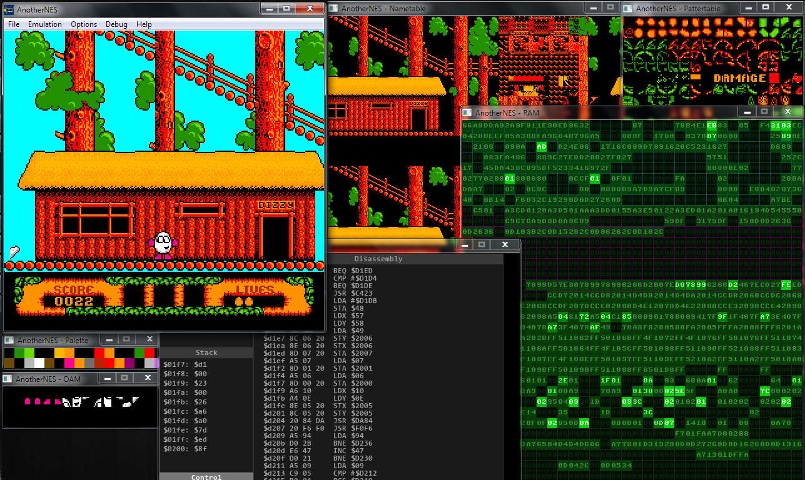
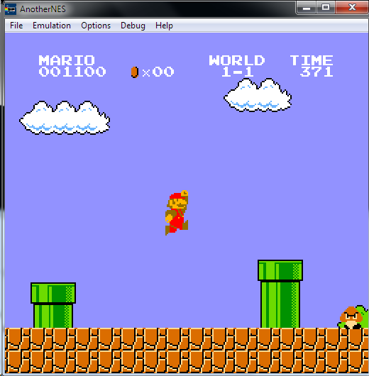

## AnotherNES - NES console  emulator/debugger

#WARNING

If you're looking for **good** NES emulator check out [PuNES](http://forums.nesdev.com/viewtopic.php?t=6928), [Nestopia](http://nestopia.sourceforge.net/) or [FCEUX](http://www.fceux.com/web/home.html).

#Introduction

This is an educational project for which purpose was learning how to create an emulator. It was created for "Programming in C++" course. I've attempted to create a usable **NES** (known also as **Famicom** in Japan, **Dendy** in Russia and **Pegasus** in Poland) emulator and result is not that bad. As for now my emulator can run many classic games (more or less are actually playable). Additional feature are somewhat cool realtime debugging features (which as for now consists of RAM view, graphics viewer and simple debugger). 

**License: GNU GPLv2**

#Language and libraries
I am using C++ (occasionally c++11 and c++14 features). The IDE is Visual Studio 2013. For graphics and sound **SDL 2** is used. As for now code is not cross-platform, because Windows libraries such as XInput and Winapi are used (it will change in a future). For GUI I've created simple SDL and **SDL_ttf** based library, but in the future I'll move to Qt.
  
#Details
- CPU (2A03, 6502 clone) - 90% completed 
	- Some bugs are not emulated properly, but it don't have any affect on games.
- PPU (Picture Processing Unit, 2C02) - 60% completed:
	- Sprite 0 Hit emulation is not perfect, unfortunately it affects some games (Code Masters/Camerica games such as Micro Machines and Fire Hawk are good examples)
	- Emphasis and grayscale bits are ignored
	- Sprite overflow bug is not emulated properly, games that rely on this quirk are unplayable.
	- Frame timing stuff needs to be set up more accurately.
- Input - 10% completed:
	- Only standard controller is emulated and controls are mapped in code to specific keys. Xbox 360 controller is supported.
	- Only first player has mapped keys.
- APU (Audio Processing Unit, 2A03) - 30%
	- Accurate sound emulation is quite hard. My attempts to create synchronous module was a failure - my emulator was running very slow and sound was choppy. As for now sound emulation is running independently of CPU and PPU, which is a bad idea but works good enough for me.
	- Pulse 1, Pulse 2, Triangle and Noise is emulated.
	- No DMC and mapper with sound chips emulation.
- Emulation - ??%
	- No save states
	- No in game saves
	- No configuration options
- Debugging - 20%
	- Pattertable viewer
	- Nametable viewer
	- Palette viewer
	- Sprite viewer
	- Live CPU RAM view
	- Simple CPU debugging and disassembly (pause, single step, run, no breakpoints)
- Mappers (address space extension) - ??% (there are tons of mappers).
	- I've emulated few the most popular mappers, so that I could run many games for testing. As for now emulated mappers are:
>
	- Mapper 0 (no address space mapping) - example games are Super Mario Bros, Battle City, Excitebike, Galaxian
	- Mapper 1 (MMC1 - basic PRG and CHR mapping with WRAM support) - Mega Man 2, Zelda, Metroid, Blaster Master
		- WRAM block is ignored
	- Mapper 2 (UxROM - PRG remapping only, CHR is 8k RAM) - Mega Man, Castlevania, Contra, Duck Tales
	- Mapper 3 (CNROM - CHR remapping only) - Arkanoid, Paperboy
	- Mapper 4 (MMC3 - one of the most popular mapper, very versatile) - Mega Man 3, Kirby's Adventure, Super Mario Bros 2 and 3 and many other.
		- IRQ emulation is inaccurate
		- Few registers are ignored (such as WRAM block and IRQ clear)
	- Mapper 7 (AxROM, Rare games, PRG remapping only, CHR is 8k RAM) - Battletoads, Beetlejuice, Wizards and Warriors
	-  Mapper 65 (Iram H3001, PRG and CHR remapping, IRQ support) - not sure which games uses this mapper, maybe I was using a bad dump?
	-  Mapper 71 (Same as Mapper 2, used for Camerica games) - The Fantastic Adventures of Dizzy, Firehawk, Micro Machines, Big Nose Freaks Out

# Controls
	
    DPAD - Up, Down, Left, Right
    A button - X
    B button - Z
    Select - A
    Start - S

# Building
To build this project you need SDL2 and SDL_ttf paths configured in Visual Studio. 

# Screenshots
  

